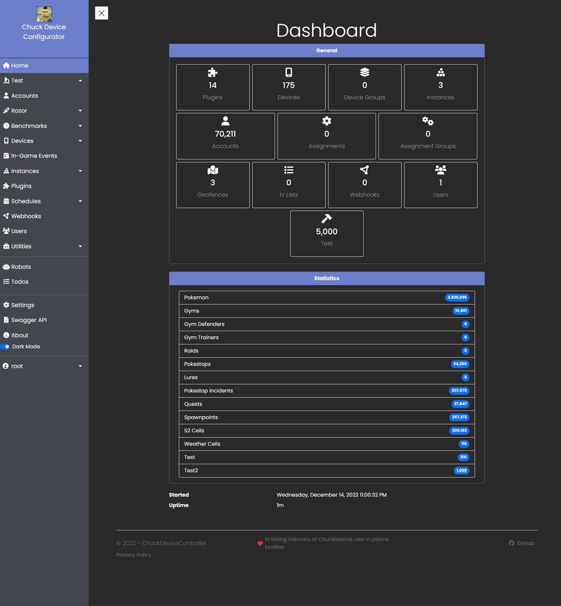

  

  

 

# Welcome to ChuckDeviceController  
ChuckDeviceController is a .NET based frontend and backend written in C# 11.0 using ASP.NET Core, EntityFramework Core, and Dapper.NET to control real devices and parse received protobuff proto data from iOS and Android mobile devices running Pokemon Go.

 

**ChuckDeviceConfigurator**  
Controls devices that request jobs as well as includes a dashboard interface to configure job controllers and other required entity types.  

- Dashboard management UI  
- Device controller  
- Plugin system  

**ChuckDeviceController**  
Parses raw proto data received and inserts/upserts data entities into a MySQL compatible database.  

**ChuckDeviceCommunicator**  
Relays new and changed data entities to outgoing webhook endpoints that are received from the ChuckDeviceController via gRPC.  

**ChuckDeviceProxy**  
Splits and proxies requests from Atlas devices to separate endpoints in order to add support for ChuckDeviceController until Atlas is updated.  

## Features  
- Plugin system  
    * Create new job controller instances  
    * Fetch database entries  
    * Add WebAPI routes and page views to existing dashboard  
    * Assign devices to job controller instances  
    * Create instances  
    * Create geofences  
    * Load/save configuration files  
    * Route generator and optimizer  
    * Event bus service for communication between plugins and host application  
    * Add custom settings to the dashboard UI  
    * Much more planned...  
- Job controller instance types  
    * Bootstrap  
    * Dynamic Route
    * Circle Pokemon  
    * Circle Raid  
    * Leveling  
    * Pokemon IV  
    * Quests  
    * Smart Raid
    * Spawnpoint TTH Finder  
    * More planned  
- User and access management system  
    * 2FA capability  
    * 3rd party authentication for Discord, GitHub, and Google accounts as well as local accounts  
- [MAD](https://github.com/Map-A-Droid/MAD) proto data parsing support
- Separate device controller, proto parser & data upsert service as well as a webhook relay service to load balance across multiple machines if needed or desired  
- Reusable Geofence and Circle point lists  
- Reusable IV lists for Pokemon IV job controller instances  
- Quality of life utilities  
    * Clear Quests (by instance, geofence, or all)  
    * Upgraded/downgraded fort converter  
    * Stale Pokestop clearing  
    * Instance reloader  
    * Truncate expired Pokemon and Incident (Invasions) data  
    * Assignments/Assignment groups re-quester  
- and more...  

## Documentation  

### Overview  
[https://cdc.rtfd.io](https://cdc.rtfd.io)  

### Getting Started  
[https://cdc.rtfd.io/en/latest/getting-started](https://cdc.rtfd.io/en/latest/getting-started)  

### Plugins  
- [Create a Plugin](https://cdc.rtfd.io/en/latest/plugin-system/create-a-plugin)  
- [API Reference](https://cdc.rtfd.io/en/latest/plugin-system/api)  
- [Templates](https://cdc.rtfd.io/en/latest/plugin-system/project-templates)  

## Getting Started  
- [Overview](https://cdc.rtfd.io/en/latest/getting-started)  
- [Requirements](https://cdc.rtfd.io/en/latest/requirements)
    - [Git](https://git-scm.com/book/en/v2/Getting-Started-Installing-Git)  
    - [.NET 7 SDK](https://dotnet.microsoft.com/download/dotnet/7.0)  
    - [MySQL](https://dev.mysql.com/downloads/mysql/) or [MariaDB](https://mariadb.org/download/?t=mariadb&p=mariadb)  
        Supported Databases  
        - MySQL 5.7 and MySQL 8.0  
        - MariaDB 10.3-10.10  
- [Preparation](https://cdc.rtfd.io/en/latest/getting-started/#preparation)  
- [ChuckDeviceConfigurator](https://cdc.rtfd.io/en/latest/getting-started/#chuckdeviceconfigurator)  
    - [Description](https://cdc.rtfd.io/en/latest/applications/configurator#description)  
    - [Configuration](https://cdc.rtfd.io/en/latest/applications/configurator#configuration)  
    - [User Identity](https://cdc.rtfd.io/en/latest/applications/configurator#user-identity)  
    - [Hosted Services](https://cdc.rtfd.io/en/latest/applications/configurator#hosted-services)  
- [ChuckDeviceController](https://cdc.rtfd.io/en/latest/getting-started/#chuckdevicecontroller)  
    - [Description](https://cdc.rtfd.io/en/latest/applications/controller#description)  
    - [Configuration](https://cdc.rtfd.io/en/latest/applications/controller#configuration)  
    - [Hosted Services](https://cdc.rtfd.io/en/latest/applications/controller#hosted-services)  
- [ChuckDeviceCommunicator](https://cdc.rtfd.io/en/latest/getting-started/#chuckdevicecommunicator)  
    - [Description](https://cdc.rtfd.io/en/latest/applications/communicator#description)  
    - [Configuration](https://cdc.rtfd.io/en/latest/applications/communicator#configuration)  
- [ChuckDeviceProxy](https://cdc.rtfd.io/en/latest/getting-started/#chuckdeviceproxy)  
    - [Description](https://cdc.rtfd.io/en/latest/applications/proxy#description)  
    - [Configuration](https://cdc.rtfd.io/en/latest/applications/proxy#configuration)  

## [Plugins Included](https://cdc.rtfd.io/en/latest/plugins/overview)  
- **BitbucketAuthProviderPlugin:**  
Adds `Bitbucket.org` user authentication support    
- **DeviceAuthPlugin:**  
Adds device token and IP based device authentication support
- **Example.DotNetCorePlugin:**  
Very basic 'Clock' plugin example  
- **FindyJumpyPlugin:**  
Adds new Pokemon spawnpoint job controllers  
- **GitLabAuthProviderPlugin:**  
Adds `GitLab.com` user authentication support  
- **HealthChecksPlugin:**  
Adds health checks endpoint and UI  
- **MemoryBenchmarkPlugin:**  
Displays basic memory usage information and chart  
- **MicrosoftAuthProviderPlugin:**  
Adds `Microsoft.com` account authentication support
- **MiniProfilerPlugin:**  
Adds basic profiling options and data.  
- **PogoEventsPlugin:**  
Provides current and upcoming Pokemon Go events.  
- **RazorTestPlugin:**  
Very basic Razor Mvc pages plugin example  
- **RedditAuthProviderPlugin:**  
Adds `Reddit.com` user authentication support  
- **RequestBenchmarkPlugin:**  
Displays web request benchmark times for routes used  
- **RobotsPlugin:**  
Adds web crawler robots management based on specified UserAgent strings and routes which creates a dynamic `robots.txt` file  
- **TestPlugin:**  
In-depth example plugin demonstrating all, if not most, possible functionality of the plugin system  
- **TodoPlugin:**  
Basic TODO list plugin that adds support for keeping track of things to do  
- **VisualStudioAuthProviderPlugin:**  
Adds `VisualStudioOnline.com` user authentication support  

## Screenshots:  
  

## TODO:  
- [ ] Finish localization  
- [ ] Finish TTH finder job controller  
- [ ] Finish implementing permissions provided by API keys  
- [ ] Finish documentation  
- [ ] Finish plugin service event callbacks  
- [ ] Add more helper methods to ChuckDeviceController.Plugin.Helpers library  
- [ ] Move most ChuckDeviceConfigurator services to plugins  

## Dedication  
❤️ In loving memory of [Chuckleslove](https://github.com/Chuckleslove), rest in peace brother
